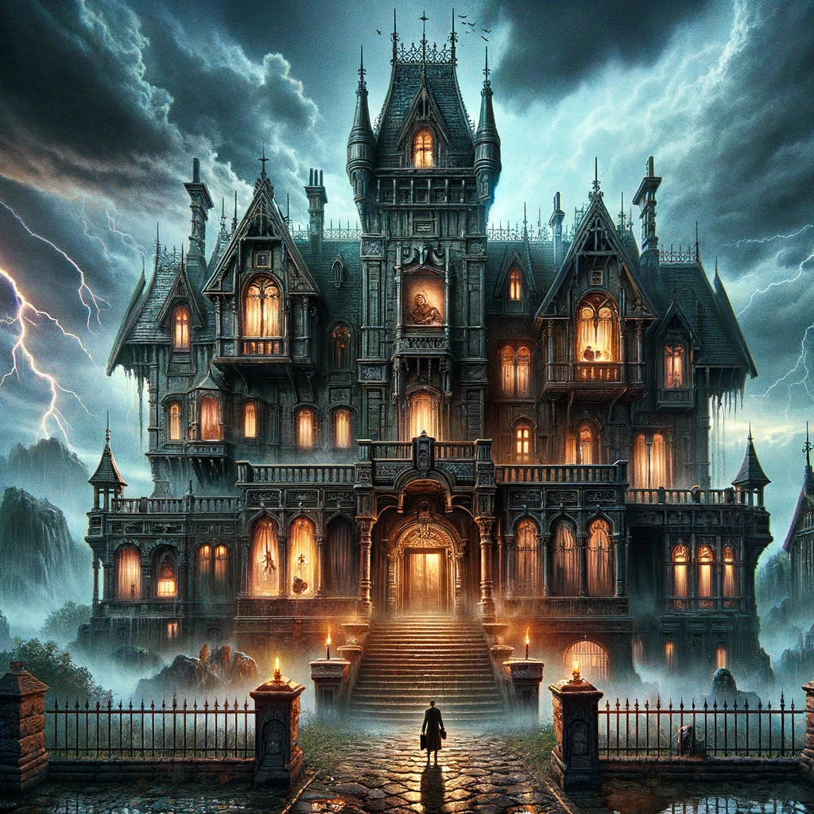
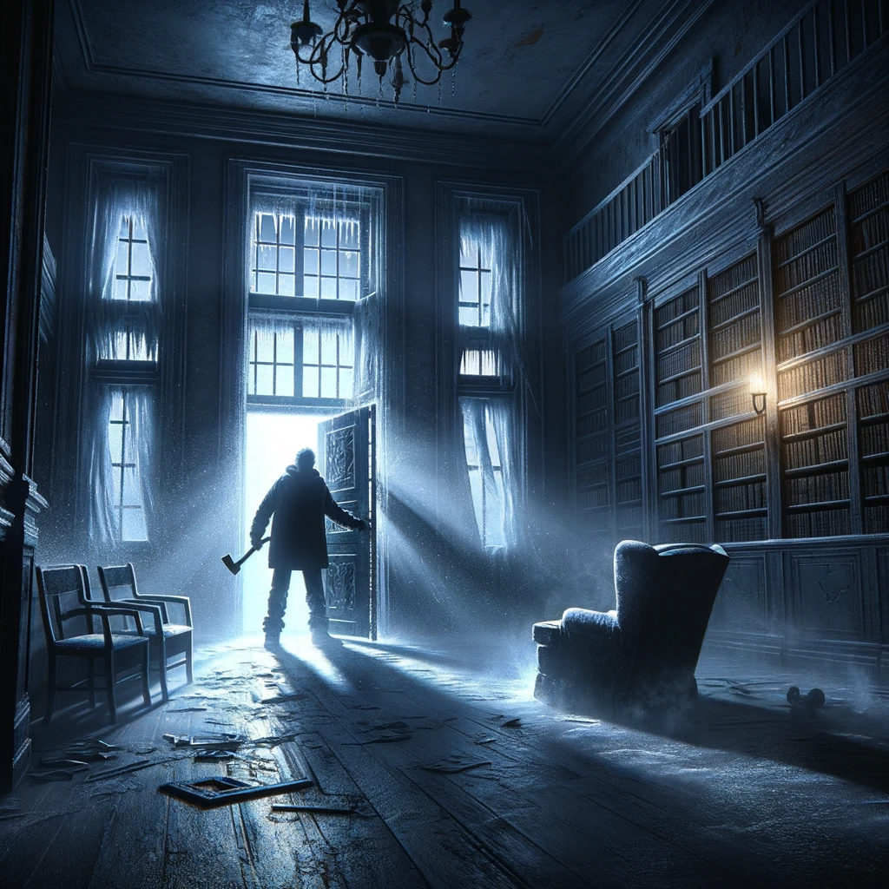
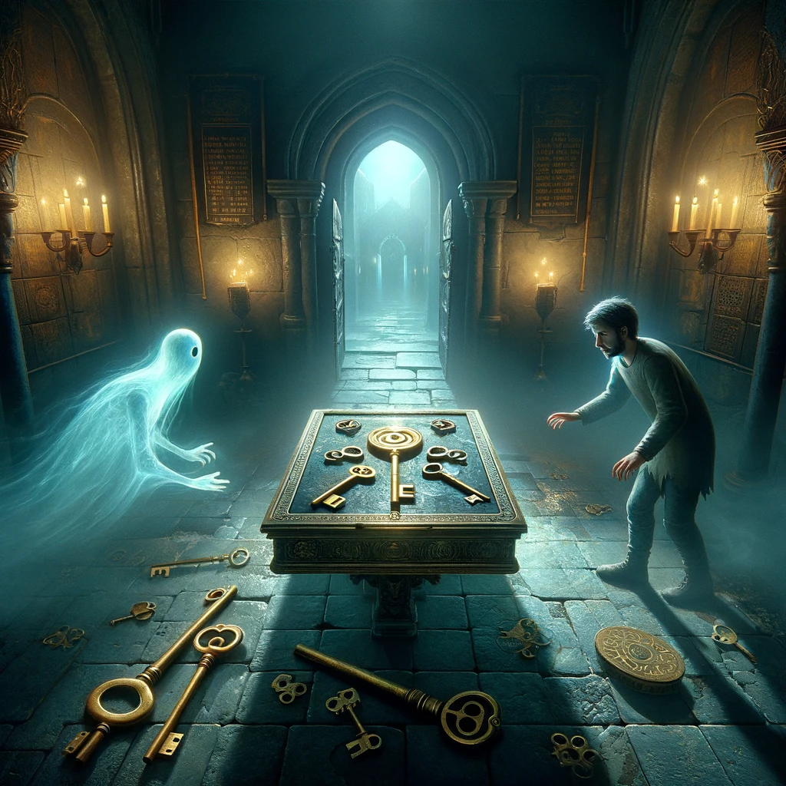
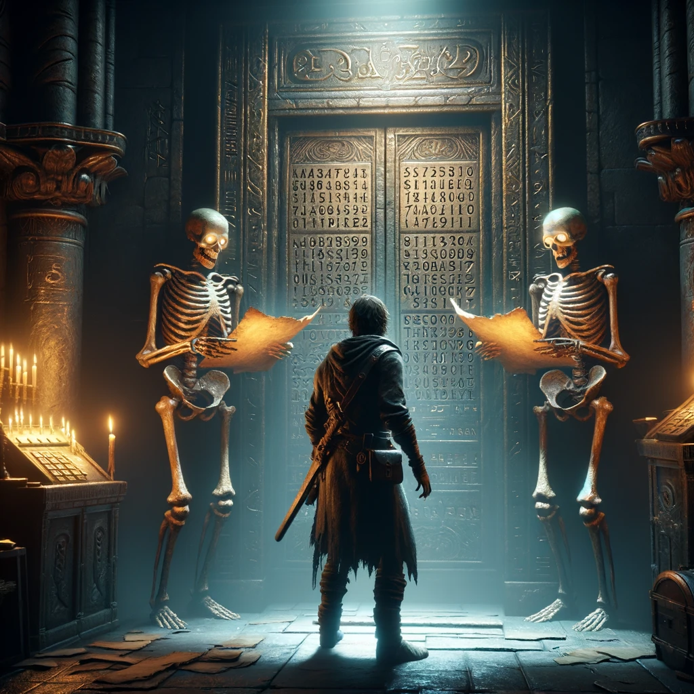
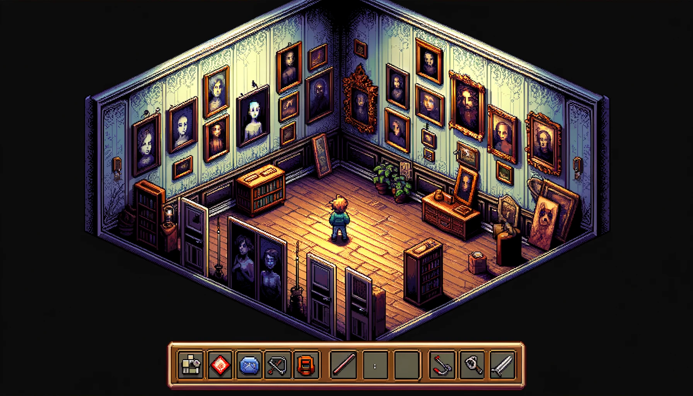
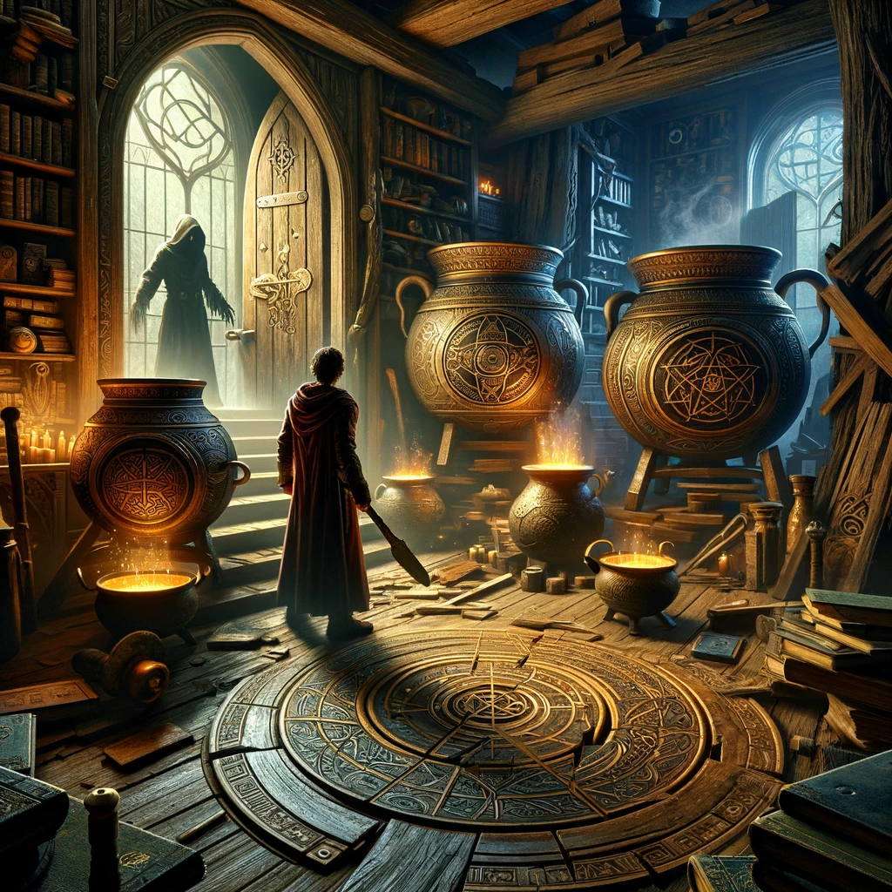
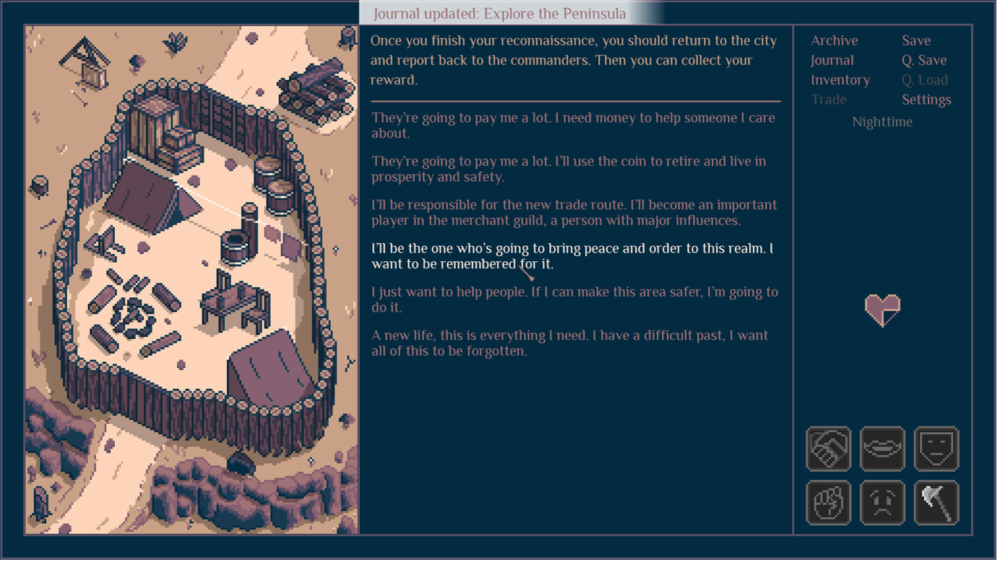

**Game Design Document**

**Titel**: Terror Trial

**Versie**: 1

**Datum**: 16-02-2024

**Studenten:**

Megan Sastroredjo, 500848607

Nii Sackey, 500927154

Giorgio de Rijp, 500926845

Sonny Chim, 500930930

Omar Asamoah, 500929403

  

  
# Overzicht

In dit Game Design Document staat beschreven welke stappen wij hebben ondernomen om tot een idee te komen voor ons spel.

  

# Mindmap

Voor het bedenken van een verhaal van onze tekst based game hebben wij eerst samen gebrainstormd. Wij zijn samen gaan zitten en hebben een mindmap op papier gemaakt, vervolgens hebben wij het digitaal in Figma gemaakt. Zodat het overzichtelijker is en iedereen er makkelijk toegang tot heeft.

**Mindmap Terror Trial:**

  

# Wireflow

Nadat de mindmap was gemaakt, hebben wij nagedacht over hoe het spel moet verlopen. Daarvoor hebben wij een wireflow gemaakt.

**Wireflow:**

   

# Verhaallijn

Tijdens onze brainstormsessie was de eerste optie een horror verhaallijn. Iedereen was het er mee eens en hebben we dat onderwerp gekozen. Vanuit de mindmap hebben wij ons verhaallijn verzonnen. Voor elke kamer (level) staat er beschreven wat de speler moet doen en kan verwachten tijdens het spelen van het spel. En ook de karakters die in het spel voorkomen.

**Spelnaam: Trial Terror**

**Intro verhaal**

In het kleine, schijnbaar vergeten stadje Ravenswood, verscholen diep in een dicht bos, stond een onheilspellend landhuis met een huiveringwekkende geschiedenis. Volgens de legende werd gezegd dat het Blackthorn Manor, zoals het bekend stond, vervloekt was door een oude kracht, die iedereen die het waagde zijn sinistere muren binnen te treden, gevangen hield.

Jij, een reiziger, bevond je op een sombere nacht in Ravenswood. Je auto begaf het, waardoor je gestrand achterbleef in dit verlaten stadje met geen andere optie dan toevlucht te zoeken in de enige structuur die leek te gloeien met een flakkerend licht - het Blackthorn Manor.

Terwijl je de drempel overstak, piepte de zware deur dreigend achter je, jouw lot bezegelend binnen de doolhofachtige gangen van het landhuis. De lucht werd dik van een ongemakkelijke stilte, en schaduwen dansten huiveringwekkend op de muren alsof ze geheimen uit het verleden fluisterden.

Plotseling weerklonk er een onlichamelijke stem door de gangen, waarbij de kwaadaardige bedoelingen van het landhuis werden onthuld. "Welkom in Blackthorn Manor, waar nachtmerries vorm aannemen. De enige manier om te ontsnappen, is om je diepste angsten te overwinnen. Ontsnap, als je kunt."

Met die huiveringwekkende verklaring sloegen de deuren dicht en werd je opgesloten. Het eens welkome gloren van de verlichting in de foyer dimde, waardoor je werd omgeven door de verstikkende omhelzing van duisternis. De enige manier vooruit is om door de kronkelende gangen te navigeren, raadsels op te lossen en de gruwelen onder ogen te zien die op de loer liggen in Blackthorn Manor. Zal je de mysteries van het vervloekte landhuis ontrafelen en ontsnappen aan zijn klauwen, of word je slechts een echo van de schaduwen die zijn vervloekte gangen bevolken? De keuze is aan jou, dappere ziel, maar wees gewaarschuwd - niet iedereen die Blackthorn Manor betreedt, komt ongedeerd naar buiten.

_De speler krijgt voor dat het spel begint een kleine intro over hoe hij/zij daar terecht is gekomen en zou moeten ontsnappen._

**Locatie:** Horror Huis

**Belangrijke voorwerpen/benodigdheden (voorwaarden):** Bijl, sleutel, cirkelzaag, 3-cijferige code, toverdank

**Karakters:** clown, spook, skelet, levend schilderij, heks

**Kamers:** Grote hal (startkamer), kamer 1, kamer 2, kamer 3, kamer 4, kamer 5

 

<h1>Level 1</h1>

De speler begint in de grote hal (startruimte), vervolgens moet de speler naar kamer 1 (teamlid 1). In de kamer staat een ladekast, bureau en boekenkast (item). De speler krijgt de optie om naar de drie items te doorzoeken en opzoek te gaan naar de clown (karakter). Als de speler de clown heeft gevonden, krijgt de speler een raadsel die opgelost moet worden (voorwaarde). Als de speler het raadsel heeft opgelost krijgt de speler een bijl (voorwerp). De speler heeft de bijl nodig om verder te kunnen naar kamer 2 (teamlid 2), daar is namelijk de deur met kettingen op slot. Die moet de speler kapotmaken met het voorwerp.

**_Raadsel:_**

De clown in kamer 1 geeft de speler het volgende raadsel: "Ik ben altijd om je heen, maar nooit gezien. Ik spreek nooit, maar iedereen begrijpt me. Wat ben ik?"

  

_Opties_:

A. Schaduw B. Wind C. Lucht D. Echo

  

_Antwoord_:

C. Lucht

 

<h1>Level 2</h1>

De speler is kamer 2 (teamlid 2) binnengekomen, hij/zij ziet op een tafel (item) 3 sleutels liggen. De speler moet het vragen aan een geest (karakter) die rond de kamer zweeft, welke sleutel de juiste is. De geest geeft de speler dan een raadsel om het op te lossen. Als de speler het raadsel heeft opgelost vertelt de geest welke sleutel (voorwerp) de juiste is. De sleutel is nodig om de deur van kamer 3 (teamlid 3) te openen.

\-             Sleutel kamer 3 bewaren

**_Raadsel:_**

 De geest vertelt de speler het volgende raadsel: "Het is groen, hangt aan een boom en is gevaarlijk als het op je valt. Wat is het?"

  

_Opties:_

A. Blad B. Vogel C. Tak D. Biljarttafel

  

_Antwoord:_

D. Biljarttafel 

 

<h1>Level 3</h1>

In kamer 3 (teamlid 3) ontmoet de speler een levend skelet (karakter). De speler krijgt van het skelet een raadsel. Als de speler alle raadsels heeft opgelost, heeft hij/zij 3 cijfers (voorwaarde). Die cijfers zijn nodig om de deur van kamer 4 te openen. De speler krijgt de cijfers in de juiste volgorde. 

**_Raadsel 1:_**

"Wat komt een man tegen en gaat een vrouw in?"

  

_Opties:_

A. Tijd B. Deur C. Snor D. Rivier

  

_Correct Answer:_

C. Snor

    

<h1>Level 4</h1>

In kamer 4 (teamlid 4) staat een paar levende schilderijen, een daarvan geeft het raadsel aan de speler. De speler moet met alle 5 schilderijen praten om uit te zoeken welk schilderij het raadsel gaat geven. Als het raadsel is opgelost vertelt het levende schilderij aan de speler dat achter een schilderij een grote kluis is verstopt met een cirkelzaag (voorwerp). De kluis (item) moet de speler openen met de 3-cijferige code die de speler kreeg in kamer 3.

**_Raadsel:_**

Het levende schilderij geeft de speler het volgende raadsel: "Ik ben groot als ik jong ben, klein als ik oud ben. Wat ben ik?"

  

_Opties:_

A. Boom B. Mens C. Kaars D. Tijd

  

Antwoord:

C. Kaars 

 

<h1>Level 5</h1>

De deur van kamer 5 (teamlid 5) moet kapot gemaakt worden met de cirkelzaag, want het heeft geen hendel of slot. Het is gemaakt van hout. Als de speler de kamer is binnengekomen ziet hij drie ketels. De speler moet elk van de ketels (item) doorzoeken om te kijken achter welke de heks (karakter) staat. Van de heks krijgt de speler een raadsel en als die is opgelost krijgt de speler een toverdrank (voorwerp). De speler kan dan dat drankje drinken en wordt uit het huis geteleporteerd.

**_Raadsel:_**

De heks achter een van de ketels geeft de speler het volgende raadsel: "Ik begin 's morgens en eindig 's avonds. Ik ben de derde keer in duizend jaren. Wat ben ik?"

  

_Opties:_

A. Tijd B. Dag C. Uur D. Seconde

  

_Antwoord:_

B. Dag

  
  
# Visualisatie

Onze inspiratie over hoe onze game eruit komt te zien hebben wij van verschillende soorten tekst based games. Er was een spel dat eruit sprong voor ons en dat was het spel Roadwarden.  Voor ons spel willen wij dat aan de linkerkant per kamer een ander afbeelding komt. In het midden komen de teksten met die klik opties te staan. Aan de rechterkant staat de naam van de speler en de hoeveelheid items die hij/zij nog moet verzamelen. Onderin komen de health points en de al verzamelde items te staan.

**Voorbeeld Roadwarden:**

  

# Bronnen

[https://www.figma.com/](https://www.figma.com/)
